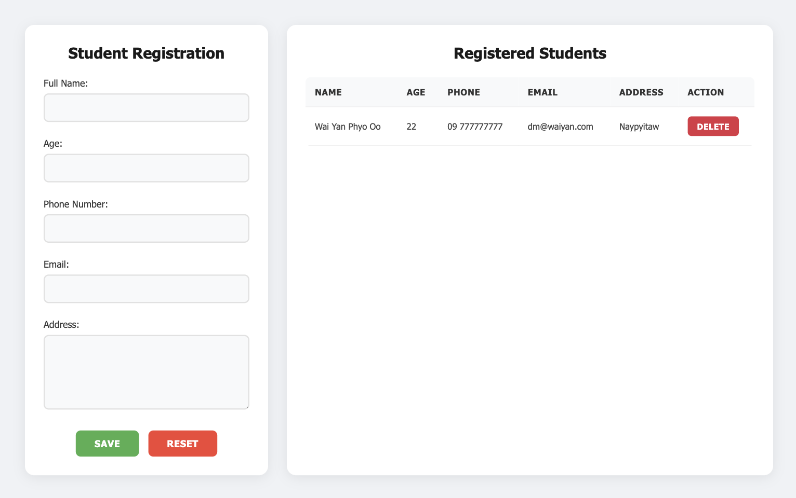

# Student Registration Form

A clean and responsive web application for managing student registrations. This application allows you to add, view, and delete student records with a modern user interface.

## 🌐 Live Demo

🔗 [View Website](https://waiyanphyooo21.github.io/reg-form/)

## 📸 Screenshots



w

## Features

- 📝 Student registration form with validation
- 📊 Real-time data display in a table format
- 🗑️ Delete functionality for individual records
- 💾 Data persistence using localStorage
- 📱 Fully responsive design
- 🎨 Modern and clean UI

## Form Fields

- Full Name
- Age
- Phone Number
- Email
- Address

## Technologies Used

- HTML5
- CSS3
- JavaScript (ES6+)
- LocalStorage for data persistence

## Project Structure

```
Student Register Form/
├── index.html      # Main HTML file
├── styles.css      # CSS styles
├── script.js       # JavaScript functionality
└── README.md       # Project documentation
```

## How to Use

1. Open `index.html` in a web browser
2. Fill out the registration form with student details
3. Click "Save" to add the student to the table
4. Click "Reset" to clear the form
5. Click "Delete" on any row to remove that student's record

## Features in Detail

### Form Features

- Input validation for required fields
- Age validation (1-120 years)
- Email format validation
- Phone number input
- Multi-line address input

### Table Features

- Real-time updates
- Responsive design
- Delete functionality with confirmation
- Clean and organized data display

### Data Persistence

- All data is saved in the browser's localStorage
- Data persists even after closing the browser
- Automatic data loading on page refresh

## Responsive Design

The application is fully responsive and works on:

- Desktop computers
- Tablets
- Mobile phones

## Browser Support

The application works on all modern browsers:

- Chrome
- Firefox
- Safari
- Edge

## Future Improvements

Potential future enhancements:

- Edit functionality for existing records
- Search and filter capabilities
- Data export functionality
- Form validation improvements
- Additional student information fields

## Contributing

Feel free to fork this project and submit pull requests for any improvements.

## License

This project is open source and available under the MIT License.

## 💻 Getting Started

1. Clone the repo:
   git clone https://waiyanphyooo21.github.io/reg-form.git
2. Open `index.html` in your browser or use Live Server in VS Code.

## 📬 Contact

- Email: dm@waiyanphyooo.online
- GitHub: [@waiyanphyooo21](https://github.com/waiyanphyooo21)

## ⭐️ Show Your Support

If you like this project, consider giving it a ⭐️ on [GitHub](https://waiyanphyooo21.github.io/reg-form/)!
